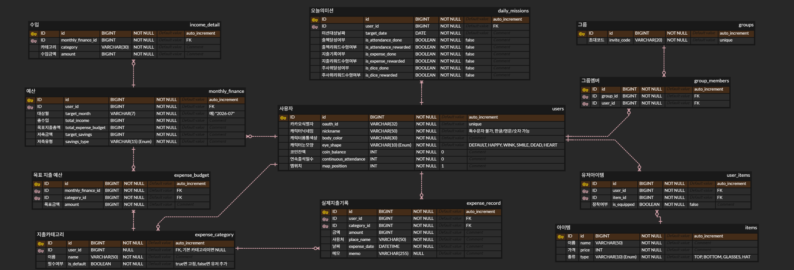

# ERD

https://www.erdcloud.com/d/udBEzZpS48XmLLJcE

# 1. Users

| **컬럼명** | **데이터 타입** | **설명** |
| --- | --- | --- |
| `id` (PK) | BIGINT | 사용자 고유 ID |
| `oauth_id` | VARCHAR(32) | 카카오 고유 식별자 |
| `nickname` | VARCHAR(50) | 사용자가 설정한 캐릭터 닉네임 |
| `body_color` | VARCHAR(30) | 선택한 캐릭터 몸통 색상 |
| `eye_shape` | VARCHAR(10) (Enum) | 선택한 캐릭터 눈 모양(DEFAULT, HAPPY, WINK, SMILE, DEAD, HEART) |
| `coin_balance` | INT | 현재 보유 중인 코인 잔액 (기본값 0) |
| `continuous_attendance` | INT | 연속 출석 일수 (기본값 0) |
| `map_position` | INT | 현재 위치하고 있는 맵 칸수 (기본값 1) |

# 2. daily_missions

| **컬럼명** | **데이터 타입** | **설명** |
| --- | --- | --- |
| `id` (PK) | BIGINT | 미션 기록 고유 ID |
| `user_id` (FK) | BIGINT | 사용자 ID |
| `target_date` | DATE | 미션 대상 날짜 |
| `is_attendance_done` | BOOLEAN | 출석체크 달성 여부 |
| `is_attendance_rewarded` | BOOLEAN | 출석체크 리워드 수령 여부 |
| `is_expense_done` | BOOLEAN | 오늘의 지출 1회 기록 달성 여부 |
| `is_expense_rewarded` | BOOLEAN | 지출 기록 리워드 수령 여부 |
| `is_dice_done` | BOOLEAN | 주사위 1회 굴리기 달성 여부 |
| `is_dice_rewarded` | BOOLEAN | 주사위 리워드 수령 여부 |

# 3. groups

| **컬럼명** | **데이터 타입** | **설명** |
| --- | --- | --- |
| `id` (PK) | BIGINT | 그룹 고유 ID |
| `invite_code` (UNIQUE) | VARCHAR(20) | 프론트엔드가 URL에 사용할 초대 링크용 코드 |

# 4. group_members

| **컬럼명** | **데이터 타입** | **설명** |
| --- | --- | --- |
| `id` (PK) | BIGINT | 매핑 고유 ID |
| `group_id` (FK) | BIGINT | 가입된 그룹 ID |
| `user_id` (FK) | BIGINT | 가입한 사용자 ID |

# 5. items

| **컬럼명** | **데이터 타입** | **설명** |
| --- | --- | --- |
| `id` (PK) | BIGINT | 상점 아이템 고유 ID |
| `name` | VARCHAR(50) | 아이템 이름 |
| `price` | INT | 구매에 필요한 코인 가격 |
| `type` | VARCHAR(10) (Enum) | 아이템 종류(TOP, BOTTOM, GLASSES, HAT) |

# 6. user_items

| **컬럼명** | **데이터 타입** | **설명** |
| --- | --- | --- |
| `id` (PK) | BIGINT | 보유 내역 고유 ID |
| `user_id` (FK) | BIGINT | 사용자 ID |
| `item_id` (FK) | BIGINT | 구매한 아이템 ID |
| `is_equipped` (FK) | BOOLEAN | 아이템 장착 여부 |

# 7. Monthly_Finance

| **컬럼명** | **데이터 타입 (추천)** | **설명** |
| --- | --- | --- |
| `id` (PK) | BIGINT | 월간 재무 요약 고유 ID |
| `user_id` (FK) | BIGINT | 사용자 ID |
| `target_month` | VARCHAR(7) | 대상 월 (예: "2026-07") |
| `total_income` | BIGINT | 한 달 총 수입 |
| `total_expense_budget` | BIGINT | 한 달 목표 지출 예산 총액 |
| `target_savings` | BIGINT | 저축 목표 금액 |
| `savings_type` | VARCHAR(15) (Enum) | 저축 유형 (SAVING, STANDARD, CHALLENGE) |

# 8. Income_Detail(수입)

| **컬럼명** | **데이터 타입 (추천)** | **설명** |
| --- | --- | --- |
| `id` (PK) | BIGINT | 수입 상세 고유 ID |
| `monthly_finance_id` (FK) | BIGINT | 부모 테이블(`Monthly_Finance`) 참조 ID |
| `category` | VARCHAR(30) | 수입 카테고리 (용돈, 알바 등) |
| `amount` | BIGINT | 해당 카테고리의 수입 금액 |

# 9. Expense_Budget(목표 지출 예산)

| **컬럼명** | **데이터 타입 (추천)** | **설명** |
| --- | --- | --- |
| `id` (PK) | BIGINT | 목표 지출 예산 고유 ID |
| `monthly_finance_id` (FK) | BIGINT | 부모 테이블(`Monthly_Finance`) 참조 ID |
| `category_id` (FK) | BIGINT | 지출 카테고리 ID (`Expense_Category` 참조) |
| `amount` | BIGINT | 해당 카테고리에 할당한 목표 금액 |

# 10. Expense_Record(실제 소비 기록)

| **컬럼명** | **데이터 타입 (추천)** | **설명** |
| --- | --- | --- |
| `id` (PK) | BIGINT | 지출 기록 고유 ID |
| `user_id` (FK) | BIGINT | 작성자(사용자) ID |
| `category_id` (FK) | BIGINT | 지출 카테고리 ID (`Expense_Category` 참조) |
| `amount` | BIGINT | 실제 지출 금액 |
| `place_name` | VARCHAR(50) | 사용처 (스타벅스, 올리브영 등) |
| `expense_date` | DATETIME | 지출 날짜 및 시간 |
| `memo` | VARCHAR(255) | 메모 (Null 허용) |

# 11. Expense_Category

| **컬럼명** | **데이터 타입** | **설명** |
| --- | --- | --- |
| `id` (PK) | BIGINT | 카테고리 고유 ID |
| `user_id` (FK) | BIGINT | Null 허용. (기본 카테고리일 땐 Null, 유저가 추가한 카테고리일 땐 해당 유저의 ID) |
| `name` | VARCHAR(50) | 카테고리명 (예: 식비, 교통, 덕질 등) |
| `is_default` | BOOLEAN | 기본 제공 카테고리 여부 (True면 고정, False면 유저 추가) |
